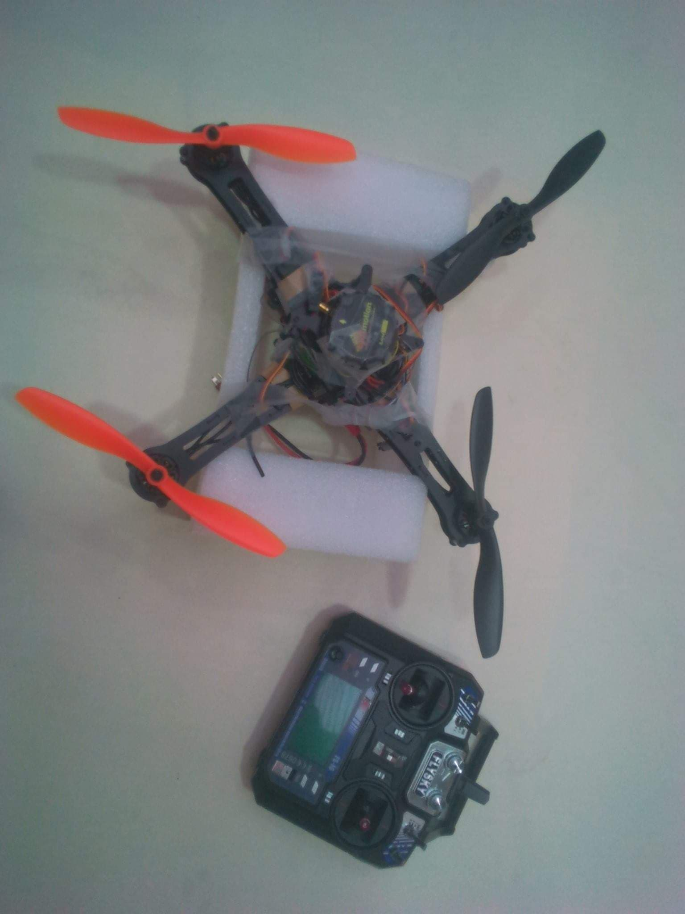

# Remotely controlled drone setup
 [Test Flight link](https://www.youtube.com/watch?v=u7fy18dJMNI&list=PLWg0Iqn2Q4SG88FVElzByj8Zt-VG_t_fO&index=2)

### Calibrations

###### ESC Calibration
MultiWii provide a firmware that has been designed only to calibrate the ESCs once it is loaded into the board and which will not allow for flight, but we followed
a Standard Calibration Procedure that we will detail. Since the ESCs do not know the range of values which they will receive from the controller as each controller
is different. Calibrating provides new min / max throttle values and will also ensure that all motors start simultaneously.

* make sure that the radio's throttle end-points are changed so that the minimum
throttle is around 1000 PWM and maximum is around 2000.
* Connect one of the brushless motors to one of the ESCs
* Plug the ESC three-wire cables into the throttle channel of the RC receiver.
* Turn on the transmitter and set throttle stick to maximum
* Turn on the battery, the motor will make a musical tone usually three beeps
indicating that the maximum end-point is set and then it will make two other
beeps indicating that it is waiting for the minimum value.
* After the two beeps, set the throttle stick to minimum. Then the motor will
make a long beep indicating that the minimum end-point value has been set
and the ESC is now calibrated.
* Disconnect battery. Repeat these steps for all ESCs.

###### Accelerometer Calibration
After connecting the board via a COM port to the WinGUI application. Speed should be set to 115200 by default. To initiate the calibration from "Calibrate ACC" button in the "Flight Deck"
tab of the WinGUI application the Quadrino Nano should maintain on a leveled surface, After a few seconds the calibration should be completed and the parameters are loaded.

###### Magnetometer Calibration
The Magnetometer should be calibrated to ensure that it will work properly. After having already calibrated the accelerometer, always from the same GUI, the calibration 
is initiated when with "Calibrate MAG" button, and once it is started the flight controller should turn 360 degree in each rotation axis full for almost a minute.

### Drone step
* Unbox the Lynxmotion and Install MultiWii softaware.
* Connect the Quadrino Nano board to the computer via a USB cable to set the required configurations.
* After finishing the settings, Flash the firmware selected into the board and install WinGUI.
* Mount the motors and the ESCs on each arm of the frame and calibrate the sensors.
* Bind the transmitter and the receiver so they can communicate with each other and perform ESC calibration.

<<  The Transmitter and Receiver should be bound to each other so they can communicate with each other. The process to follow is simple,
connect the bind plug into the Bind pins of your Receiver as well as a battery with the transmitter turned on, red light will blink. Then hold down the bind
button on the Transmitter and turn it on, the flashing light on the Receiver will become stable and this means that your Transmitter and Receiver are
now bounded to each other then Remove the bind plug..>>

* Stick the Flight Controller firmly onto the platform Using strong double-sided foam tape tape.
* Connect the ESCs to the Quadrino Nano using the colored wire harness for an easy connection, shipped with the board according to the multirotor
type, Figure 3.11. The ESC plugged to the three wires will power the flight controller with its internal voltage regulator (BEC).

* Connect the Radio Receiver Module to the Flight Controller via the cables provided using the schematics shown in  Figure 3.12. The four wires correspond to PWM signals,  The GND and 5V will power up the Receiver from the Flight Controller.

* Arm the motors by pushing the Yaw stick all the way down to the right, the transmitter Sticks will change motor speeds. Disarming is done with the same process.

## Control System of the quadcopter
When moving the transmitter sticks which are nothing but a potentiometers, voltage will be generated through a radio signal to the receiver that will interpret
these signals and sends roll, pitch and yaw rates as well as the thrust to the flight controller.
The flight controller gets the measurements through the sensors, compares it with the desired set points, applies a PID controller that can be tuned from WinGUI and
send the output as a PWM signals to the ESCs.
PWM signals applied to each of the ESCs will power the motors, the propellers will turn and generate different thrust force which will determine the quadcopter
maneuver.

